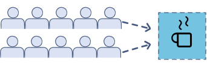

## Go Concurrency

The key component of the Go concurrency model is the **goroutine**, which is the minimum executable entity in Go.

Each goroutine is executed on a single OS thread according to the instructions of the **Go scheduler**, which is responsible for the execution of goroutines.

However, goroutines cannot directly communicate with each other. Data sharing in Go is implemented using either **channels or shared memory**.


When you combine multiple `channels` and `goroutines` you can create data flows, which in Go terminology are also called **pipelines**.


### Processes, threads, and goroutines

**A process** is an OS representation of a running `program`, while a `program` is a binary file on disk that contains all the information necessary for creating an **OS process**.

The binary file is written in a specific format (ELF on Linux) and contains all the instructions the CPU is going to run as well as a plethora of other useful sections. 

That program is loaded into memory and the instructions are executed, creating a running process. 
So, a process carries with it additional resources such as memory, opened file descriptions, and user data as well as other types of resources that are obtained during runtime.


**A thread** is a smaller and lighter entity than a process. Processes consist of one or more threads that have their own flow of control and stack

**A goroutine** is the minimum Go entity that can be executed concurrently. The use of the word minimum is very important here, as goroutines are not autonomous entities like UNIX processes  —goroutines live in OS threads that live in OS processes.

The good thing is that goroutines are lighter than threads, which, in turn, are lighter than processes  —running thousands or hundreds of thousands of goroutines on a single machine is not a problem.


### The Go scheduler

The **OS kernel scheduler** is responsible for the execution of the threads of a program. This is controlled by the Operating system it self.

But remember Go allows creation of goroutines which are very small and run inside threads (This is not the default way the OS is programmed to work). Therefore there must be some magic happening.

The Go runtime has its own scheduler, which is responsible for the execution of the goroutines using a technique known as **m:n scheduling**


So what is **m:n scheduling** ?

A kernel thread is needed for the actual execution of code and parallelism. But it’s expensive to create, So we map **N** goroutines to **M** Kernel Thread. 

Goroutine is the Go Code, so we have full control over it. Also, it’s in the user-space so it is cheap to create.
But as **OS doesn’t know anything** about the goroutine. Every goroutine has a **state** to help Scheduler knows which goroutine to run based on goroutine state.

These goroutines have several states, they are
- Running — goroutine currently running on kernel thread.
- Runnable — goroutine waiting for kernel thread to run.
- Blocked — Goroutines waiting for some conditions (e.g. blocked on a channel, syscall, mutex, etc.)

So a **Go Runtime Scheduler** manages these goroutines at various states, by Multiplexing N Goroutine to M Kernel Thread.

> Be aware that as the Go scheduler only deals with the goroutines of a single program, its operation is much simpler, cheaper, and faster than the operation of the kernel scheduler.

Note: For Go to be able to implement concurrency, It uses the **fork-join concurrency model**

### What is the fork-join concurrency model

In parallel computing, the fork–join model is a way of setting up and executing parallel programs, such that `execution` branches off in parallel at designated `points` in the program, to "join" (merge) at a subsequent point and **resume sequential execution**.

So when we run a go program, Go can start a child branch at any point of a program. When this child branch is done running, It can join it's parent at a specified "Join  Point".

```pseudocode
    solve(problem):
        if problem is small enough:
            solve problem directly (sequential algorithm)
        else:
            for part in subdivide(problem)
                fork subtask to solve(part)  //The recursive part a program is forked
            join all subtasks spawned in previous loop //The join part where the child has to re-connect to
            return combined results
```

The Go scheduler works using three main kinds of entities: 
1. OS threads (M), which are related to the OS in use.
2. goroutines (G).
3. logical processors (P). 
The number of processors that can be used by a Go program is specified by the value of the GOMAXPROCS environment variable—at any given time, there are at most `${GOMAXPROCS}` processors.

### The GOMAXPROCS environment variable
The GOMAXPROCS environment variable allows you to set the number of OS threads (CPUs) that can execute user-level Go code simultaneously.

> The default value of GOMAXPROCS should be the number of logical cores available in your machine. 


### Concurrency and parallelism

Concurrency is not Parallelism

**Parallelism** is the simultaneous execution of multiple entities of some kind, 
whereas **concurrency** is a way of structuring your components so that they can be executed independently when possible

Let's describe better this using [this article from toptal](https://www.toptal.com/software/introduction-to-concurrent-programming)

Concurrency is when you are doing more than one thing at the same time. This should not be confused with parallelism, concurrency is when multiple sequences of operations are run in overlapping periods of time.

In case the above definitions are still confusing, Look at it this way 

**concurrent programming** is a technique in which two or more processes start, run in an interleaved fashion through **context switching** and complete in an overlapping time period by managing access to shared resources e.g. on a single core of CPU.

This doesn’t necessarily mean that multiple processes will be running at the same instant – even if the results might make it seem like it.

### What is the difference between concurrency and parallelism ?

In parallel programming, parallel processing is achieved through hardware parallelism e.g. executing two processes on two separate CPU cores simultaneously.


To practically explain this, Let's use a bar where there are two queue of bar attenders wanting to get a cup of coffee

- **Concurrent:** Two Queues & a Single Espresso machine. 

- **Parallel:** Two Queues & Two Espresso machines.


### Goroutines

Remember from earlier definitions that a goroutine is the minimum Go entity that can be executed concurrently

You can define, create, and execute a new goroutine using the go keyword followed by a function name or an anonymous function.

 The go keyword makes the function call **return immediately**, while the function starts running in the **background** as a goroutine and the rest of the program continues its execution.

> You cannot control or make any assumptions about the order in which your goroutines are going to be executed because that depends on the scheduler of the OS, the Go scheduler, and the load of the OS.

```go
func printme(x int) {
        fmt.Printf("%d ", x)
}

func main() {
    //Running an anonymous go routine
    go func(x int) {
        fmt.Printf("%d ", x)
    }(10) //pass a parameter to the function

    // This is how you execute a function as a goroutine.
    go printme(15)

    // the purpose of the time.Sleep() call is to make the go program wait for it's goroutines to end before exiting
    time.Sleep(time.Second)
    fmt.Println("Exiting...")
}
```

### Channels

A channel is a communication mechanism that, among other things, allows goroutines to exchange data.

Firstly, each channel allows the exchange of a **particular data type**, which is also called the **element type** of the channel, and secondly, for a channel to operate properly, you need someone to receive what is sent via the channel.

**A pipeline** is a virtual method for connecting goroutines and channels so that the output of one goroutine becomes the input of another goroutine using channels to transfer your data.

### Race conditions
A data race condition is a situation where two or more running elements, such as threads and goroutines, try to take control of or modify a shared resource or shared variable of a program.
A data race occurs when two or more instructions access the same memory address, where more than one of them performs a write (change) operation.

for instance imagine this: 

```go
package main

func printer(ch chan bool) {
	ch <- true
}

func main() {
	// This is an unbuffered channel
	var ch chan bool = make(chan bool)
	for i := 0; i < 5; i++ {
		go printer(ch)
	}
}

// The issuee with this implementation here is that the same channel is been written to by several goroutines
// This is called Race Condition
//If a litener mistakenly closes the channel, there might be a panick.
```

To fix the above issue, we can re-write this to be


```go
func printer(ch chan<- bool, times int) {
	for i := 0; i < times; i++ {
		ch <- true
	}
	close(ch)
}

func main() {
	// This is an unbuffered channel
	var ch chan bool = make(chan bool)

	// Write 5 values to channel with a single goroutine
	go printer(ch, 5)

}
```

### The select keyword

The select keyword is really important because it allows you to listen to multiple channels at the same time.