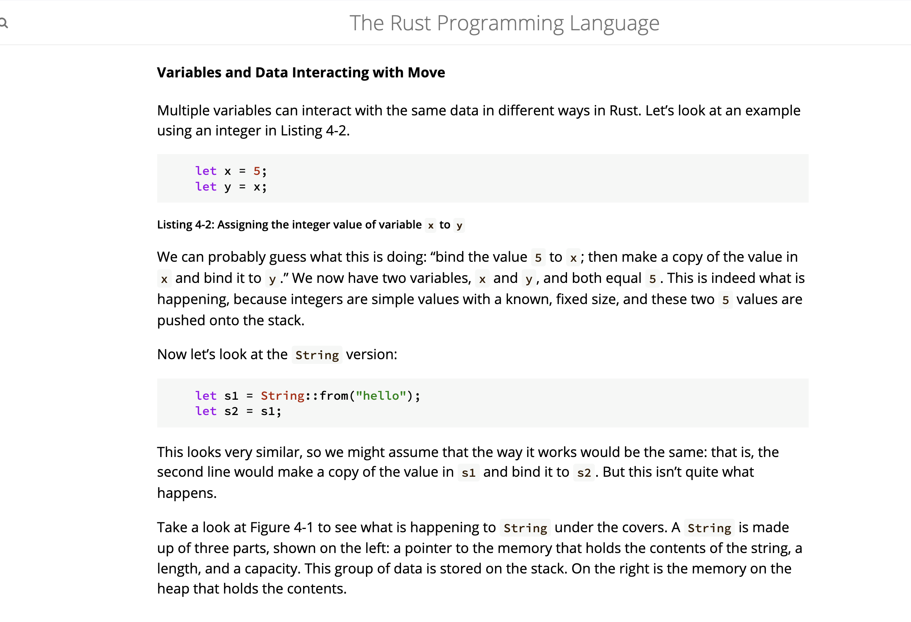
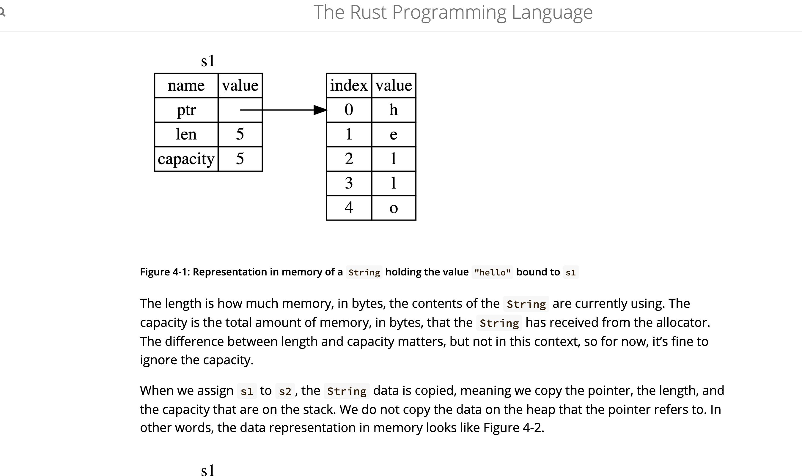
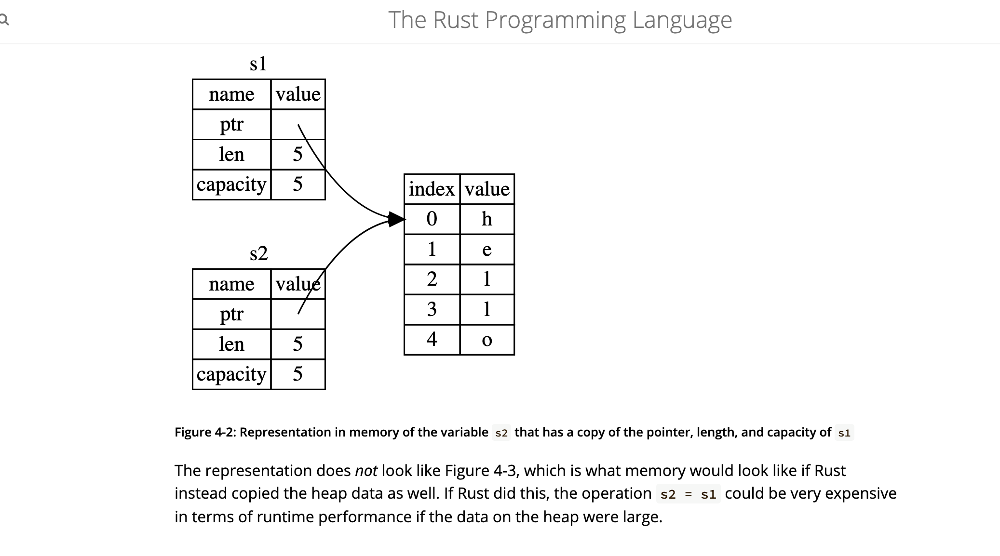
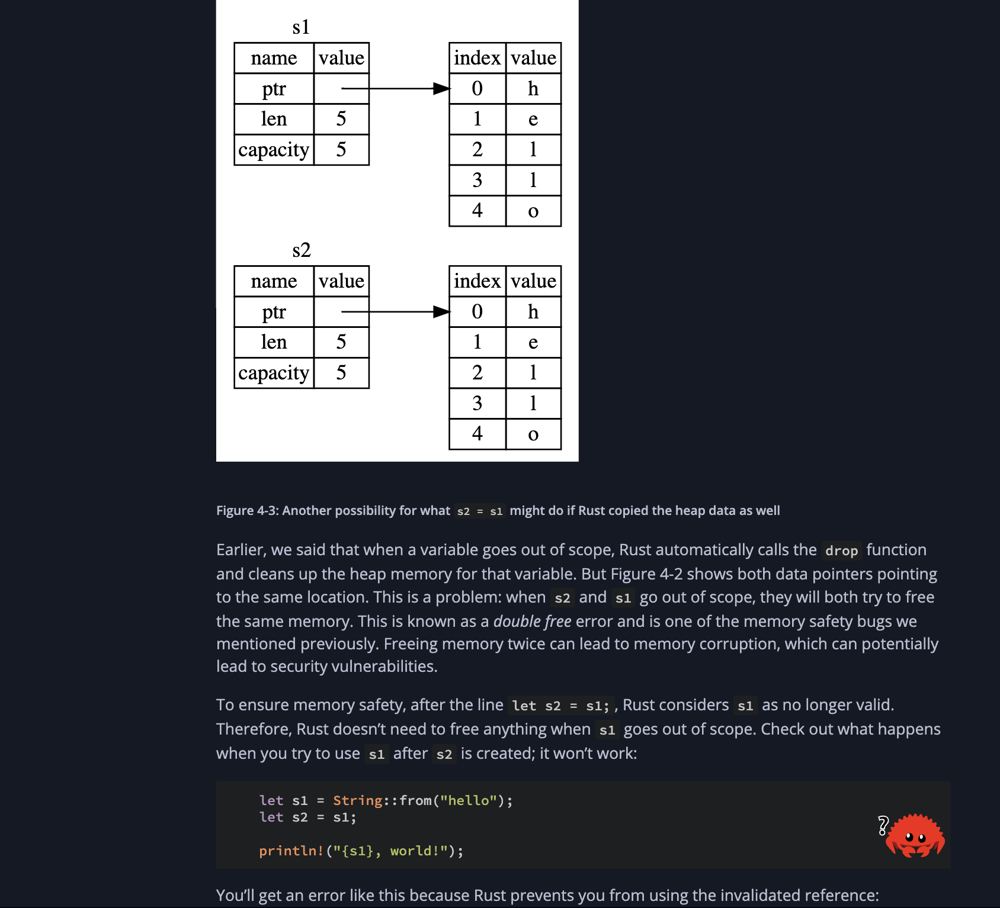
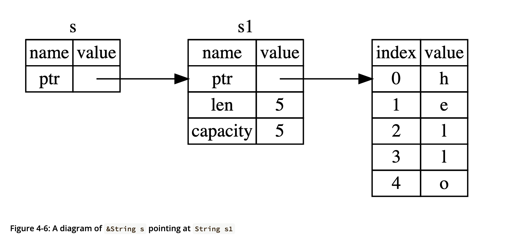

### What Is Ownership?

Ownership is a set of rules that govern how a Rust program manages memory. 

Every program must handle its use of computer memory during execution. Some languages feature automatic garbage collection to reclaim unused memory, while others require programmers to manually allocate and release it.
Rust uses a third approach: memory is managed through a system of ownership with a set of rules that the compiler checks. If any of the rules are violated, the program won’t compile. None of the features of ownership will slow down your program while it’s running.


#### The Stack and the Heap
Both the stack and the heap are parts of memory available to your code to use at runtime, but they are structured in different ways.
The stack stores values in the order it gets them and removes the values in the opposite order. This is referred to as last in, first out.
Adding data is called `pushing` onto the stack, and removing data is called `popping` off the stack.
All data stored on the stack must have a known, fixed size. Data with an unknown size at compile time or a size that might change must be stored on the heap instead.

The heap is less organized: when you put data on the heap, you request a certain amount of space. The memory allocator finds an empty spot in the heap that is big enough, marks it as being in use, and returns a pointer, which is the address of that location. This process is called `allocating on the heap` or `allocating` for short.

Recall a function runs in the stack, the dynamic memories like slices created at runtime are stored on the heap and it's pointer returned, Heap pointers have a fixed size, allowing them to be efficiently stored on the stack. Accessing the actual data on the stack requires following the heap pointer. 

Pushing to the stack is faster than allocating on the heap because the allocator never has to search for a place to store new data; that location is always at the top of the stack. Comparatively, Allocating heap space is more complex, as it involves finding sufficient space and managing bookkeeping for future allocations.

Accessing data in the heap is slower than accessing data on the stack because you have to follow a pointer to get there.

Contemporary processors perform faster when they access memory in a more sequential manner, reducing the need for frequent jumps to different memory locations. A processor operates more efficiently with data stored nearby, like on the stack, than with data spread out, as on the heap.

Ownership solves the problem of managing heap data by tracking usage, reducing duplication, and cleaning up unused memory to prevent running out of space. Once you understand ownership, you rarely need to worry about the stack or heap, but knowing its role in heap management helps explain its design.

#### Ownership Rules

1. Each value in Rust has an owner.
2. There can only be one owner at a time.
3. When the owner goes out of scope, the value will be dropped.

#### Using The String Type
Rust has a `String` type that can be used to store growing text data that is unknown to us at compile time., this is usually stored on the heap. e.g `let s = String::from("hello");`
This kind of string can be mutated:
```rust
    let mut s = String::from("hello");

    s.push_str(", world!"); // push_str() appends a literal to a String

    println!("{s}"); // This will print `hello, world!`
```

Because the `String` type in Rust is designed to be mutable and growable, its underlying text content needs to be stored on the heap. The amount of memory required for this storage cannot be determined when the program is compiled. This means:

- The memory must be requested from the memory allocator at runtime.
- We need a way of returning this memory to the allocator when we’re done with our String.

When we use `String::from`, we trigger the memory allocation needed to store the text. This memory request is a standard practice across most programming languages. This achieves the first point.

Unlike languages with garbage collection that automatically manage unused memory, most languages require manual memory deallocation, a historically error-prone task (forgetting leaks memory, freeing too early causes invalid access, freeing twice is also a bug). Rust offers a different approach: memory is automatically freed when the variable that owns it goes out of scope, as demonstrated in this scope example using a `String`.

```rust
    {
        let s = String::from("hello"); // s is valid from this point forward

        // do stuff with s
    }                                  // this scope is now over, and s is no
                                       // longer valid
```

When a variable goes out of scope, Rust calls a special function called `drop`, Rust calls `drop` automatically at the closing curly bracket.

To understand what happens to a typical `String` type in stack and in heap, look at the explanation below





A String is made up of three parts: a pointer to the memory(heap) that holds the contents of the string, a length, and a capacity. This group of data is stored on the stack.

Consider this code below

```rust
    let mut s = String::from("hello");
    s = String::from("ahoy");

    println!("{s}, world!");
```
When you assign a completely new value to an existing variable, Rust will call drop and free the original value’s memory immediately.

##### Variables and Data Interacting with Clone
If we do want to deeply copy the heap data of the String, not just the stack data, we can use a common method called clone.

```rust
    let s1 = String::from("hello");
    let s2 = s1.clone();

    println!("s1 = {s1}, s2 = {s2}");
```
This works just fine and explicitly produces the behavior shown in Figure 4-3([String assumed memory](./string_fourth.png)
), where the heap data does get copied.

##### Ownership and Functions
The mechanics of passing a value to a function are similar to those when assigning a value to a variable. Passing a variable to a function will move or copy, just as assignment does. 

```rust
fn main() {
    let s = String::from("hello");  // s comes into scope

    takes_ownership(s);             // s's value moves into the function...
                                    // ... and so is no longer valid here

    let x = 5;                      // x comes into scope

    makes_copy(x);                  // because i32 implements the Copy trait,
                                    // x does NOT move into the function,
    println!("{}", x);              // so it's okay to use x afterward

} // Here, x goes out of scope, then s. But because s's value was moved, nothing
  // special happens.

fn takes_ownership(some_string: String) { // some_string comes into scope
    println!("{some_string}");
} // Here, some_string goes out of scope and `drop` is called. The backing
  // memory is freed.

fn makes_copy(some_integer: i32) { // some_integer comes into scope
    println!("{some_integer}");
} // Here, some_integer goes out of scope. Nothing special happens.
```
If we tried to use `s` after the call to takes_ownership, Rust would throw a compile-time error. 


##### Return Values and Scope
Returning values can also transfer ownership. Let's look a the example below

```rust
fn main() {
    let s1 = gives_ownership();         // gives_ownership moves its return
                                        // value into s1

    let s2 = String::from("hello");     // s2 comes into scope

    let s3 = takes_and_gives_back(s2);  // s2 is moved into
                                        // takes_and_gives_back, which also
                                        // moves its return value into s3
} // Here, s3 goes out of scope and is dropped. s2 was moved, so nothing
  // happens. s1 goes out of scope and is dropped.

fn gives_ownership() -> String {             // gives_ownership will move its
                                             // return value into the function
                                             // that calls it

    let some_string = String::from("yours"); // some_string comes into scope

    some_string                              // some_string is returned and
                                             // moves out to the calling
                                             // function
}

// This function takes a String and returns one
fn takes_and_gives_back(a_string: String) -> String { // a_string comes into
                                                      // scope

    a_string  // a_string is returned and moves out to the calling function
}
```
The ownership of a variable follows the same pattern every time: assigning a value to another variable moves it. When a variable that includes data on the heap goes out of scope, the value will be cleaned up by `drop` unless ownership of the data has been moved to another variable.

Repeatedly transferring and returning ownership in functions can be cumbersome. It’s inconvenient to pass a value to a function and have to return it back just to reuse it, especially alongside other results. Rust offers a solution by allowing multiple values to be returned via a tuple.

```rust
fn main() {
    let s1 = String::from("hello");

    let (s2, len) = calculate_length(s1);

    println!("The length of '{s2}' is {len}.");
}

fn calculate_length(s: String) -> (String, usize) {
    let length = s.len(); // len() returns the length of a String

    (s, length)
}
```

### References and Borrowing

In the example above, we return the `String` to retain access after calling `calculate_length` since ownership is moved. A better approach is passing a reference instead.
A **reference** is like a **pointer** in that it’s an address we can follow to access the data stored at that address; that data is owned by some other variable. Unlike a **pointer**, a **reference** is guaranteed to point to a valid value of a particular type for the life of that reference.

```rust
fn main() {
    let s1 = String::from("hello");

    let len = calculate_length(&s1);

    println!("The length of '{s1}' is {len}.");
}

fn calculate_length(s: &String) -> usize {
    s.len()
}
```
The above demonstrates how to define and use a `calculate_length` function that uses a reference to a value instead of taking ownership of it.

The diagram below shows visually how the reference is pointing to the pointer that is on the stack the `s1` string variable represents.



We call the action of creating a reference `borrowing`.

#### Mutable References

Just as variables are immutable by default, so are references. We’re not allowed to modify something we have a reference to.
We can make it possible to modify a reference by using **mutable reference**.

```rust
fn main() {
    let mut s = String::from("hello");

    change(&mut s);
}

fn change(some_string: &mut String) {
    some_string.push_str(", world");
}
```

> Mutable references have one big restriction: if you have a mutable reference to a value, you can have no other references to that value. 

```rust
    let mut s = String::from("hello");

    let r1 = &mut s;
    let r2 = &mut s;

    println!("{}, {}", r1, r2);

```
The code above will not run because `r1` borrows `s` for mutation and `r2` also borrows `s` for mutation within same scope when `r1` has not handed back ownership.

But we can use curly brackets to create a new scope, allowing for multiple mutable references, just not simultaneous ones:

```rust
    let mut s = String::from("hello");

    {
        let r1 = &mut s;
    } // r1 goes out of scope here, so we can make a new reference with no problems.

    let r2 = &mut s;

```

#### Dangling References
In languages with pointers, freeing memory while keeping a pointer to it can easily create a dangling pointer: pointing to memory that might now belong to someone else. Rust’s compiler, however, prevents this by ensuring references never dangle: It ensures that the data a reference points to won't be deallocated before the reference itself is no longer valid.

```rust
fn main() {
    let reference_to_nothing = dangle();
}

fn dangle_func() -> &String { // dangle returns a reference to a String

    let s = String::from("hello"); // s is a new String

    &s // we return a reference to the String, s
} // Here, s goes out of scope, and is dropped. Its memory goes away.
  // Danger!
```

Look at the code above: Because `s` is created inside `dangle_func`, when the code of `dangle_func` is finished, `s` will be deallocated. But we tried to return a reference to it. That means this reference would be pointing to an invalid String. That’s no good! Rust won’t let us do this.


### The Slice Type
Slices let you reference a contiguous sequence of elements in a collection rather than the whole collection. A slice is a kind of reference, so it does not have ownership.

#### String Slices

A string slice is a reference to part of a String, and it looks like this:

```rust
    let s = String::from("hello world");

    let hello = &s[0..5];
    let world = &s[6..11];

    let s = String::from("hello");
    // these two mean the same thing
    let slice = &s[0..2];
    let slice = &s[..2];


    let len = s.len();

    // these two mean the same
    let slice = &s[3..len];
    let slice = &s[3..];

    // take a slice of the entire string
    let slice = &s[0..len];
    let slice = &s[..];


    // function to return the first word in a sentence
    fn first_word(s: &String) -> &str {
        let bytes = s.as_bytes();

        for (i, &item) in bytes.iter().enumerate() {
            if item == b' ' { // if it's not empty space
                return &s[0..i];
            }
        }

        &s[..]
    }
```
Rather than a reference to the entire `String`, `hello` is a reference to a portion of the String, specified in the extra `[0..5]` bit. 

##### String Literals as Slices
In the case of a string literal, we know the contents at compile time, so the text is hardcoded directly into the final executable. This is why string literals are fast and efficient.

```rust
let s = "Hello, world!";
```

The type of `s` here is `&str`: it’s a slice pointing to that specific point of the executable binary. This is also why string literals are immutable; &str is an immutable reference.

we can rewrite our `first_word` function to take an `&str` input to allow string literals

```rust
    fn first_word(s: &str) -> &str {
        let bytes = s.as_bytes();

        for (i, &item) in bytes.iter().enumerate() {
            if item == b' ' {
                return &s[0..i];
            }
        }

        &s[..]
    }

    let my_string = String::from("hello world");
    let my_string = String::from("hello world");

    let word = first_word(&my_string[..]);
    // `first_word` also works on references to `String`s, which are equivalent to whole slices of `String`s
    let word = first_word(&my_string);

     let my_string_literal = "hello world";

    let word = first_word(&my_string_literal[..]);

    // Because string literals *are* string slices already, this works too, without the slice syntax!
    let word = first_word(my_string_literal);
```


##### Other Slices
String slices, as you might imagine, are specific to strings. But there’s a more general slice type too. Consider this array:
```rust
let a = [1, 2, 3, 4, 5];

// this turns the array to a slice
let slice = &a[1..3];

assert_eq!(slice, &[2, 3]);
```


